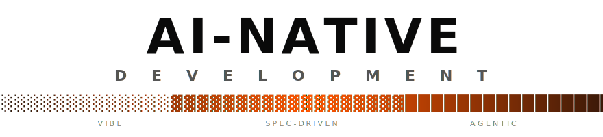
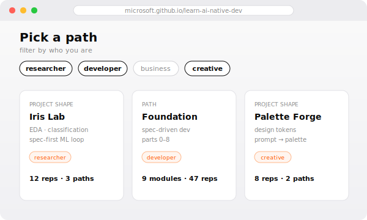
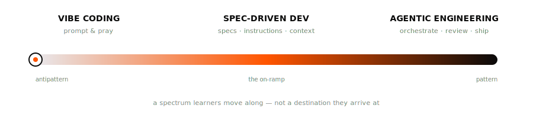
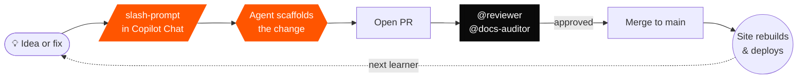

<div align="center">

<picture>
  <source media="(prefers-color-scheme: dark)"  srcset="docs/assets/wordmark-dark.svg">
  <source media="(prefers-color-scheme: light)" srcset="docs/assets/wordmark-light.svg">
  
</picture>

<sub>practice · intuition · agentic engineering — shaped in the open</sub>

<br/>

<a href="#-contribute"></a>
<a href="LICENSE"></a>
<a href="LICENSE-DOCS"></a>

<br/>

<!-- live status strip -->
<a href="https://github.com/microsoft/learn-ai-native-dev/actions/workflows/deploy-pages.yml"></a>
<a href="https://github.com/microsoft/learn-ai-native-dev/commits/main"></a>
<a href="https://github.com/microsoft/learn-ai-native-dev/graphs/contributors"></a>
<a href="https://github.com/microsoft/learn-ai-native-dev/stargazers"></a>
<a href="https://github.com/microsoft/learn-ai-native-dev/issues"></a>

<br/><br/>

> **Build _with_ AI, not just _using_ it.**
>
> A living, community-shaped curriculum for the practice of agentic coding.

<br/>

</div>

<!-- Two-door hero: pick your path. Learn (most visitors) on the left, Contribute on the right.
     Uses an HTML table because GitHub renders it side-by-side on desktop and stacked on mobile. -->
<table align="center" width="100%">
  <tr>
    <td align="center" width="50%" valign="top">
      <h3>🎓 &nbsp;I'm here to <em>learn</em></h3>
      <sub>no install · no signup · free · open in any browser</sub>
      <br/><br/>
      <a href="https://microsoft.github.io/learn-ai-native-dev/">
        
      </a>
      <br/><br/>
      <a href="https://microsoft.github.io/learn-ai-native-dev/"></a>
      <br/><br/>
      <a href="https://microsoft.github.io/learn-ai-native-dev/"><kbd>microsoft.github.io/learn-ai-native-dev</kbd></a>
    </td>
    <td align="center" width="50%" valign="top">
      <h3>✍️ &nbsp;I'm here to <em>contribute</em></h3>
      <sub>this repo <em>is</em> the contribution platform</sub>
      <br/><br/>
      <a href="#-contribute">
        
      </a>
      <br/><br/>
      <a href="#-contribute"></a>
      <br/><br/>
      <a href="#-quick-start"><kbd>git clone &amp; npm run dev</kbd></a>
    </td>
  </tr>
</table>

<div align="center">

</div>

---

## ◢ Quick start

_For contributors running the site locally. Just learning? Open the
tutorial above — nothing to install._

```bash
git clone https://github.com/microsoft/learn-ai-native-dev.git
cd learn-ai-native-dev && npm install && npm run dev
```

Open <http://localhost:5173>. That's it.

```
React 19 · TypeScript · Vite 7 · Tailwind v4 · shadcn/ui · Radix
```

---

## ◢ What you'll be able to do

This isn't a catalog of skills, agents, or MCP configs. Those are the *medium*; the
product is **intuition** — knowing _which_ to reach for, _when_, and _with what bounds_.

- ☑︎ Tell when a problem wants a one-shot prompt vs. a spec vs. a full agent loop
- ☑︎ Recognize a runaway agent before the token bill does
- ☑︎ Spot the difference between a lazy prompt and a structured one — and feel it in your output
- ☑︎ Move from _vibe-prompting_ → _spec-driven_ → _agentic engineering_ — and know which one a problem calls for
- ☑︎ Pick up MCP, custom agents, and skills as **tools you reach for**, not lore you memorize

> _Capability is reference. Intuition is curriculum._ — [`docs/philosophy.md`](docs/philosophy.md) §2

---

## ◢ Why this exists

Agentic coding is barely three years old. Models change every quarter, tools change every month, and yesterday's "best practice" is tomorrow's antipattern. **Nobody has the hindsight yet to publish a durable catalog of patterns** — not us, not anyone. Anyone who claims otherwise is selling snapshots as truths.

So we're not writing one. We're building the opposite: **a place to get reps on problems you actually care about.**

<div align="center">
  
</div>

You don't get good at agentic coding by memorizing pattern names. You get good by shipping small things, seeing contrast (the lazy prompt beside the structured one), and accumulating taste. This site is built for that — and it grows when **you** add the problem you wish someone had taught you on.

<div align="center">
  
</div>

<details>
<summary><sub>text equivalent · accessibility</sub></summary>

- ░ **vibe coding** — vibe-prompting, runaway loops, the "just one more retry".
- ▓ **spec-driven** — specs, instruction files, bounded context.
- █ **agentic engineering** — structured prompts, custom agents, the spec that ships.

A spectrum learners move along — not a destination they arrive at.

</details>

---

## ◢ What's inside

Three content kinds, one filter that runs across all of them.

| Kind | The question it answers | Shape |
|:--|:--|:--|
| **Path** | _Teach me a coherent body of work._ | Foundation · Agentic · Terminal · Community |
| **Recipe** | _Show me one thing applied to one problem._ | 5–15 min, audience-tagged |
| **Project Shape** | _What problem do I want to apply this to?_ | Iris Lab · Deal Dashboard · Palette Forge · yours next |

Filter everything by **audience** — `researcher · developer · business · creative` — and the catalog reshapes around what _you_ build. No pattern-of-the-month. No taxonomy gatekeeping.

> Read the north star: [`docs/philosophy.md`](docs/philosophy.md).

---

## ◢ The contribution loop

Every change to this curriculum runs through the same AI-assisted flow — the repo eats its own dogfood.



> The slash-prompts: `/add-example` · `/fix-content` · `/refresh-content` · `/propose-topic`.

---

## ◢ Contribute

**This repo is the contribution platform.** The site is the artifact; this repo is the workshop where the curriculum gets shaped — by people learning this in real time, together.

The most valuable thing you can add is the **rep you wish you'd had**. A recipe that solved a real problem. A project shape from your domain. A diagram that finally made it click. A correction that saves the next person an hour.

```
  ╭──────────────────────────────────────────────────────────────╮
  │   Got 10 minutes?   →  Open an issue. Fix a typo. Add a tag. │
  │   Got an evening?   →  Write a recipe. Add a project shape.  │
  │   Got a weekend?    →  Propose a module or a community path. │
  ╰──────────────────────────────────────────────────────────────╯
```

Run a slash-prompt in Copilot Chat and the matching agent scaffolds the change. Open the PR; `@reviewer` and `@docs-auditor` weigh in automatically.

Before you start, the philosophy gives you a 6-question checklist to know if a piece of content is ready: _problem · verbs · feedback · audience · capability+version · (optional) name_ — see [`docs/philosophy.md`](docs/philosophy.md) §8.

> Start here → [`.github/CONTRIBUTING.md`](.github/CONTRIBUTING.md) · [`.github/AUTHORING.md`](.github/AUTHORING.md)

A repo built by the community, where AI helps you contribute to a curriculum about contributing with AI. That's the loop.

### Shaped by

<a href="https://github.com/microsoft/learn-ai-native-dev/graphs/contributors">
  
</a>

---

## ◢ Repository map

```
src/content/      ←── ✦ where most contributions live (markdown)
src/components/   ←── React + interactive diagrams
src/data/         ←── paths, project shapes, content mappings
.github/          ←── the build harness: agents · skills · prompts · instructions
docs/             ←── design spec & north-star philosophy
```

Two surfaces, two homes: [`docs/`](docs) is _what we teach_, [`.github/`](.github) is _how we edit it_. See [`docs/harness.md`](docs/harness.md) for the map.

---

## ◢ License · Security · Conduct

- **Code** → [MIT](LICENSE) · **Content & docs** → [CC BY 4.0](LICENSE-DOCS) · third-party attributions in [`NOTICE`](NOTICE).
- **Security** → please don't open public issues for vulnerabilities. See [`SECURITY.md`](SECURITY.md) and <https://aka.ms/SECURITY.md>.
- **Code of Conduct** → [Microsoft Open Source Code of Conduct](https://opensource.microsoft.com/codeofconduct/) · [`CODE_OF_CONDUCT.md`](CODE_OF_CONDUCT.md).
- **Trademarks** → use of Microsoft or third-party marks must follow [Microsoft's Trademark & Brand Guidelines](https://www.microsoft.com/en-us/legal/intellectualproperty/trademarks/usage/general).

© Microsoft Corporation.

---

<div align="center">

```
   ─────────────────────────────────────────────────────────────
    The future isn't AI replacing developers.
    It's developers — together — figuring out what good looks like.
   ─────────────────────────────────────────────────────────────
```

<sub>built in the open · shaped by contributors · ⭐ if it helped, so the next person finds it</sub>

</div>
